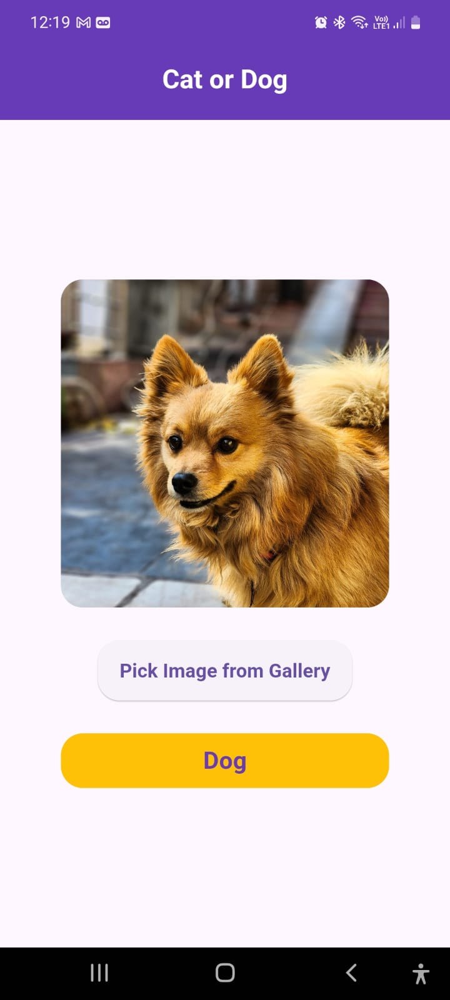

# Cat or Dog Identification App

## Overview

The Cat or Dog Identification App is a Flutter-based mobile application that uses a pre-trained TensorFlow Lite model to identify whether an image contains a cat or a dog. The app allows users to select an image from their gallery, processes the image using machine learning, and displays the prediction result.

## Features

- **Image Selection**: Pick an image from your gallery.
- **Image Classification**: Uses a TensorFlow Lite model to classify the image as either a cat or a dog.
- **Result Display**: Shows the selected image along with the classification result.

.png)

## Screenshots

| Home Screen                     | Result Screen                   |
|---------------------------------|---------------------------------|
|  |  |

## Getting Started

### Prerequisites

Before you begin, ensure you have met the following requirements:

- Flutter SDK installed on your local machine. Follow the instructions [here](https://flutter.dev/docs/get-started/install) to install it.
- An IDE like Visual Studio Code or Android Studio.
- A device or emulator to run the Flutter application.
